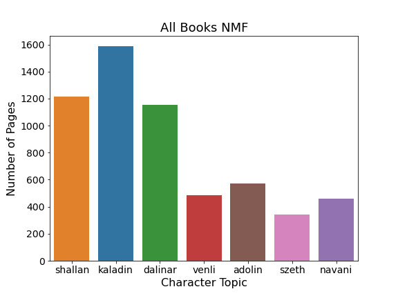
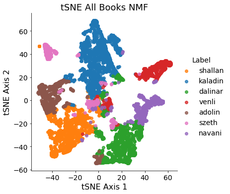
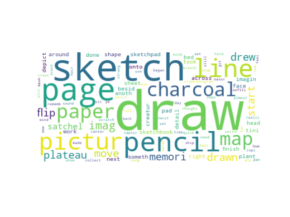
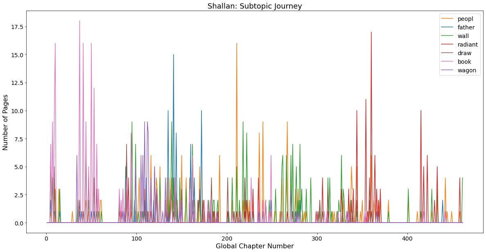

# Natural Language Processing on "The Stormlight Archive"

This project was developed over two and a half weeks as part of the [Metis](https://www.thisismetis.com/) data science boot-camp in Winter 2021.

### Objective:
---

[The Stormlight Archive](https://www.brandonsanderson.com/the-stormlight-archive-series/) is an on-going high fantasy series by author Brandon Sanderson. It currently consists of four books with over 400 chapters and 5000 pages, which is more than enough text for an NLP project. As a favorite series of mine, and having just re-read the series following the release of the fourth book in November 2020, I decided to have a little fun and use it as the data source in an NLP project. I wanted to develop my NLP skills, while investigating the main characters and exploring the topics which describe them.

*Disclaimer: Nothing here is a major spoiler, but in case you are interested in reading these books, it might be best to look through this project after having done so!*

### Methodology and Results:
---

First, the four books of the series (as purchased from Amazon for Kindle) were converted into PDF format and then read in to python scripts using [pdfplumber](https://github.com/jsvine/pdfplumber). The text was then processed in chapter and page-level increments, using NLTK and standard text-preprocessing steps, ie. stemming, stop-word removal, punctuation removal, tokenization, etc. 

After the text was processed, I did kMeans clustering, and NMF and LDA topic modeling on the text. The NMF topic modeling performed the best without much tuning so I chose that as my main analysis technique for the project. (The kMeans clustering and LDA topic modeling performed okay, but the results were not as clean.)

The topic modeling converged naturally (and probably unsurprisingly) on the main characters themselves as the topics, with the various character names being the top weighted word for each topic. The distribution of page-documents as labeled by their top topic can be seen in the figure below. There are 7 topics which aligns with the number of main characters, and each topic has been labeled by the respective main character.

After the initial topic modeling, I did dimensionality reduction with MDS and tSNE. Using the NMF topic vectors per page-document with cosine distances, the tSNE plot can be seen below. Character clusters surround the outside of the plot, with some interaction between the various characters. At the middle there is a region where the NMF topic modeling had more difficulty selecting the particular character-topic, and these points can be understood as those pages where characters were simultaneously featured within the books.

From there, I decided to perform further topic modeling on the main characters themselves in order to find specific character sub-topics. I added character names to the stop-words list in order to select on more thematic topics. The word cloud below is that for a single subtopic for the character Shallan. Shallan is an artist, and the topic modeling readily found related words.

This last plot then shows the trend of Shallan's journey throughout the book in terms of her sub-topics. These subtopics are labeled by their top weighted words. Clusters of pink at the beginning, blue, orange, and green in the middle, and then red at the end correspond to various plot points and character moments. For instance the pink in the beginning labeled by "book" references to her leisure times at the beginning of the story when she's beginning her journey. Conversely, the red "radiant" parts at the end refer to her growth as a person and a hero in the most recent book.

As a last step, I did attempt some sentiment analysis of the chapters and pages for each character, using TextBlob and vaderSentiment. While the graphs came out okay-looking, when cross-referenced to the text, the trends didn't make much sense. I ultimately decided to scrap this part of the project. With more time and perhaps a finer document level (paragraph or single sentences), this might be worth exploring more. This finer document level might also serve to get at even more thematic topics within the books, such as loss, faith, honor, redemption, and so on, which the books feature quite a lot, but to which my topic modeling was mostly insensitive.

### Tools and Techniques:
---

- Text preprocessing: [pdfplumber](https://github.com/jsvine/pdfplumber), nltk (stemming, tokenization, stop-word removal, etc.)
- Text vectorization with CountVectorizer and TfidfVectorizer
- kMeans clustering
- NMF and LDA topic modeling
- Word embedding via MDS and tSNE
- Visualization via Matplotlib and Seaborn
- Sentiment analysis via TextBlob and vaderSentiment

### File Details:
---

- `code/`

	- `doNLP.ipynb` - main code which does various clustering, topic modeling, dimensionality reduction, and sentiment analysis on the four books 
	- `nlpUtils.py` - file which provides the methods for the clustering and topic modeling routines
	- `plotUtils.py` - file which provides various plotting methods, including word embedding plots, word clouds, etc.
	- `extractAndCleanText.ipynb` - notebook for extracting and cleaning the book text in chapter level increments
	- `extractAndCleanTextByPage.ipynb` - notebook for extracting and cleaning the book text in page level increments
	- `extractText.ipynb` - notebook for extracting and the book text in chapter-level increments, with no text preprocessing
	- `nlpEDA.ipynb` - notebook used for initial NLP EDA and parameter optimization 
	- `sentimentEDA.ipynb` - notebook used for initial sentiment analysis EDA (more was eventually done at the bottom of the main `doNLP.ipynb` file)
	- `bookChaptersPageNumbers.py` - file which provided the page numbers for chapters, used when reading in and processing the book text

	- `sla_chapter_text.pkl` - pickled pandas dataframe containing processed chapter-level text, one chapter per row
	- `sla_page_text.pkl` - pickled pandas dataframe containing processed page-level text, one page per row
	- `sla_chapter_text_unprocessed.pkl` - pickled pandas dataframe containing unprocessed chapter-level text, one chapter per row

- `StormlightArchiveBooks/`

	- This folder contains the Stormlight Archive books (1-4) by Brandon Sanderson in PDF format on my own computer. I purchased these books through Amazon and used them in this NLP project. For rights reasons I am not committing the books themselves to this public repository.

	- `BookPageInfo.xlsx` - excel file containing information related to the book chapters and relevant pages, along with a "global chapter number" variable that was useful in cross-referencing the text
	
